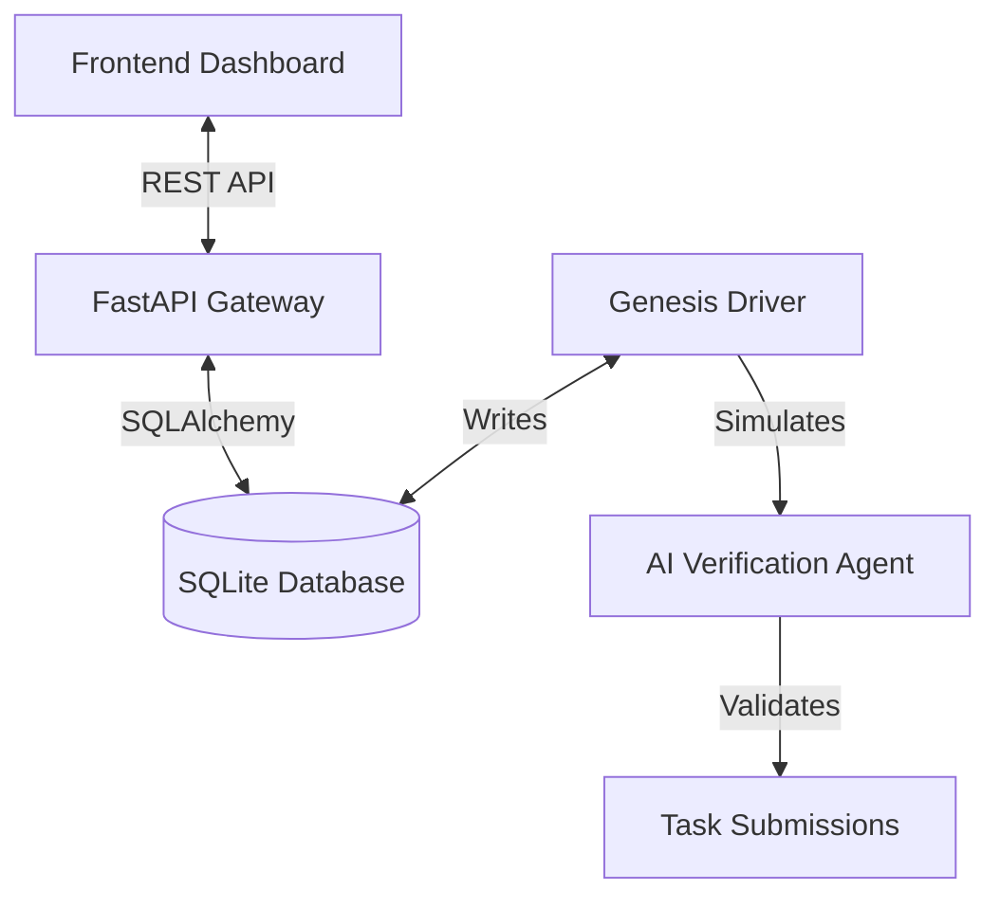

# HumanEffortCoin (HEC) - Proof-of-Labor Economic Oracle


> **"Currency backed by the most valuable resource on Earth: Human Time."**

HumanEffortCoin (HEC) is an autonomous economic protocol that mints currency based on verified human labor. Unlike Bitcoin (Proof-of-Work) which expends energy, or Ethereum (Proof-of-Stake) which relies on capital, HEC introduces **Proof-of-Labor (PoL)**.

This repository is a fully functional **Economic Oracle & Simulation** that demonstrates the entire lifecycle: Task Creation → AI Verification → Token Minting → Economic Growth.

---

## 📑 Table of Contents

- [🌟 Key Features](#-key-features)
- [🏗️ System Architecture](#-system-architecture)
- [🚀 Quick Start Guide](#-quick-start-guide)
- [📂 Project Structure](#-project-structure)
- [🛠️ How to Fork & Customize](#-how-to-fork--customize)
  - [Adding New Task Types](#1-adding-new-task-types)
  - [Modifying the Economic Formula](#2-modifying-the-economic-formula)
  - [Customizing the Dashboard](#3-customizing-the-dashboard)
- [🔌 API Reference](#-api-reference)
- [🗺️ Roadmap & Ideas](#-roadmap--ideas)
- [🤝 Contributing](#-contributing)

---

## 🌟 Key Features

- **Autonomous Economy**: A self-running simulation driver (`genesis_driver.py`) that generates users, tasks, and transactions.
- **AI Verification Agent**: A mock AI system that evaluates "proof of work" (GPS, photos, telemetry) to approve or reject claims.
- **Real-time Dashboard**: A premium, skeuomorphic React UI that visualizes the economy in real-time.
- **Dynamic GDP**: Watch the economy grow as more labor is verified.
- **Simulation Control**: Pause, resume, and inspect the system state directly from the UI.

---

## 🏗️ System Architecture

The system consists of three distinct components working in harmony:



1.  **HEC Core (Backend)**: Python/FastAPI server that exposes data to the world.
2.  **Genesis Driver (Simulation)**: A background process that acts as the "World Engine", creating users and simulating labor.
3.  **HEC Dashboard (Frontend)**: A React/Vite application for visualization and control.

---

## 🚀 Quick Start Guide

Follow these steps to get your own instance running in minutes.

### Prerequisites
- Python 3.9+
- Node.js 16+

### 1. Clone & Setup Backend
```bash
git clone https://github.com/sohamds1/human-effort-coin.git
cd human-effort-coin

# Install Python dependencies
pip install fastapi uvicorn sqlalchemy
```

### 2. Setup Frontend
```bash
cd hec-dashboard
npm install
cd ..
```

### 3. Run the System (The "Trinity")
You need **3 separate terminal windows** to run the full stack:

**Terminal 1: The API Server**
```bash
cd hec-core
python -m uvicorn api.main:app --port 8000 --reload
```

**Terminal 2: The Simulation Driver**
```bash
# Windows
$env:PYTHONIOENCODING='utf-8'
python hec-core/genesis_driver.py

# Mac/Linux
export PYTHONIOENCODING=utf-8
python hec-core/genesis_driver.py
```

**Terminal 3: The Dashboard**
```bash
cd hec-dashboard
npm run dev
```

Open **http://localhost:5173** to see your economy alive!

---

## 📂 Project Structure

Understanding the codebase is key to customization.

```text
human-effort-coin/
├── hec-core/                  # 🐍 PYTHON BACKEND
│   ├── agent/                 # AI Logic
│   │   └── blockchain.py      # Mock Ledger & Verification Logic
│   ├── api/                   # FastAPI Server
│   │   ├── main.py            # App Entry Point
│   │   └── routes.py          # API Endpoints (/stats, /feed)
│   ├── database/              # Database Layer
│   │   └── models.py          # User, Task, Submission Models
│   └── genesis_driver.py      # 🤖 THE SIMULATION ENGINE (Start here!)
│
├── hec-dashboard/             # ⚛️ REACT FRONTEND
│   ├── src/
│   │   ├── App.jsx            # Main Dashboard Logic
│   │   └── index.css          # Styling (Skeuomorphic Design)
│   └── ...
│
└── hec_world_v3.db            # SQLite Database (Auto-created)
```

---

## 🛠️ How to Fork & Customize

This project is designed to be hacked. Here are the most common things you'll want to change.

### 1. Adding New Task Types
Want to add "Coding" or "Teaching" as verifiable labor?

1. Open `hec-core/genesis_driver.py`
2. Find the `TASK_TYPES` list.
3. Add your new task:
   ```python
   {
       "type": "OPEN_SOURCE_CONTRIBUTION",
       "skill_multiplier": 2.5,  # High value work!
       "evidence_required": ["GITHUB_PR_LINK", "MERGE_HASH"]
   }
   ```
4. Restart the driver. The simulation will now generate these tasks!

### 2. Modifying the Economic Formula
Want to change how tokens are calculated?

1. Open `hec-core/genesis_driver.py`
2. Locate the `calculate_mint_amount` function.
3. Change the logic:
   ```python
   # Example: Add a bonus for weekend work
   mint_amount = (hours * skill_multiplier)
   if is_weekend():
       mint_amount *= 1.5
   ```

### 3. Customizing the Dashboard
Want to change the color scheme or branding?

1. Open `hec-dashboard/src/index.css`
2. The design uses CSS variables. Change the `:root` values:
   ```css
   :root {
     --primary-accent: #ff00ff; /* Change to your brand color */
     --bg-dark: #0a0a0a;
   }
   ```
3. To change the layout, edit `hec-dashboard/src/App.jsx`.

---

## 🔌 API Reference

The backend exposes a REST API at `http://localhost:8000`.

| Method | Endpoint | Description |
|--------|----------|-------------|
| `GET` | `/stats` | Global economy stats (GDP, Users, Minted) |
| `GET` | `/feed` | Recent transactions and verifications |
| `GET` | `/simulation/status` | Check if simulation is running |
| `POST` | `/simulation/start` | Resume the simulation driver |
| `POST` | `/simulation/stop` | Pause the simulation driver |

---

## 🗺️ Roadmap & Ideas

If you're looking for something to build, here are some great "Next Steps" for this project:

- [ ] **Real AI Integration**: Replace the mock verification in `blockchain.py` with OpenAI/Gemini API to actually analyze image proofs.
- [ ] **Mobile App**: Build a React Native app to allow *real* users to submit tasks (GPS/Camera).
- [ ] **Blockchain Bridge**: Write a Solidity contract to mint *real* tokens on Polygon/Ethereum based on the Oracle's output.
- [ ] **Multi-Tenant**: Allow multiple organizations to run their own HEC economies.

---

## 🤝 Contributing

1. Fork the Project
2. Create your Feature Branch (`git checkout -b feature/AmazingFeature`)
3. Commit your Changes (`git commit -m 'Add some AmazingFeature'`)
4. Push to the Branch (`git push origin feature/AmazingFeature`)
5. Open a Pull Request

---

## 📜 License

Distributed under the MIT License. See `LICENSE` for more information.

---

**Built with ❤️ by Soham Das**
